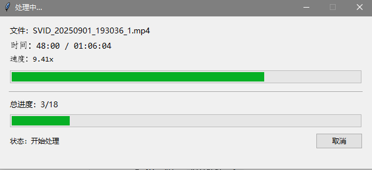

# ffmpegVideoConvert 🎬

一个基于 **FFmpeg** 的批量视频处理工具，提供简洁的可视化界面，支持多文件选择、进度显示、任务取消，并拓展了合并与拆分场景。

---

## ✨ 软件功能

- **五种处理模式**
  - 保全画质：接近无损压缩，CRF≈18。
  - 优先压缩：文件尽量小，CRF≈28，自动限制最大分辨率 1080p。
  - 仅提取音频：输出 `.m4a` 格式（AAC 128k）。
  - 视频合并：一次选择多个视频并在界面中调整拼接顺序，生成单个成片。
  - 视频拆分：针对单个视频输入多个时间戳（秒数或 `HH:MM:SS[.ms]`），自动切成多段。

- **批量/多段处理**：常规模式支持一次导入多个视频，拆分模式可自动生成多段片段。
- **输出目录自定义**：所有处理结果统一保存到用户指定文件夹，自动避免重名覆盖，可独立选择合并/拆分输出位置。
- **实时进度可视化**
  - 当前视频：已处理时长 / 总时长、处理速度（如 10.5x）。
  - 总体进度：已完成数量 / 总数量。
  - 总用时：任务运行时间实时刷新。
- **任务控制**
  - 任务完成：弹窗提示，进度窗按钮变“关闭”。
  - 支持随时取消：立即终止 FFmpeg 进程。
- **环境自检**：启动时检查 `ffmpeg`、`ffprobe` 是否可用，缺失时及时提示。
- **后台静默运行**：处理时不会弹出黑色命令行窗口（Windows）。

---

## 📥 输入 & 📤 输出

- **输入文件**：常见视频格式（`.mp4 .mov .mkv .avi .flv .wmv .m4v .ts .webm`）  
- **输出文件**：
  - 保全画质 → `原文件名_hq.mp4`
  - 优先压缩 → `原文件名_small.mp4`
  - 仅音频 → `原文件名.m4a`
  - 视频合并 → 默认 `第一个文件名_merged.原扩展名`（可在输出目录调整）
  - 视频拆分 → `原文件名_partXX.原扩展名`
- 文件名冲突时，自动在结尾加 `_1/_2/...`

---

## 💻 exe 运行条件

1. **操作系统**：Windows 10 / 11  
2. **依赖**：需要用户手动安装 [FFmpeg](https://ffmpeg.org/download.html)，并配置到系统环境变量 PATH  
   - 验证方式（在命令行执行）：  
     ```bash
     ffmpeg -version
     ffprobe -version
     ```
   - 能输出版本号即配置成功。  
3. **硬件**：普通 PC 即可，推荐有多核 CPU 以加快转码。  

---

## 🚀 使用说明

1. 双击运行 `ffmpegVideoConvert.exe`。
2. 按提示选择处理模式（保全画质 / 优先压缩 / 仅提取音频 / 视频合并 / 视频拆分）。
3. 根据模式完成参数配置：
   - **常规转码模式**：一次选择一个或多个视频文件，然后选择统一输出目录。
   - **视频合并模式**：
     1. 选择至少两个视频文件。
     2. 在“调整拼接顺序”窗口中拖动/按钮调整顺序并确认。
     3. 指定合并结果的输出目录和文件名。
   - **视频拆分模式**：
     1. 选择一个需要拆分的视频文件。
     2. 在弹窗中输入多个时间戳（以逗号、空格或换行分隔）。
     3. 选择拆分后片段的保存目录。
4. 等待处理完成：
   - 窗口中实时显示当前片段进度、处理速度以及总体进度。
   - 支持任务中途取消；全部完成后按钮变为“关闭”，并弹窗提示输出位置。

---

## 📄 License

MIT License



